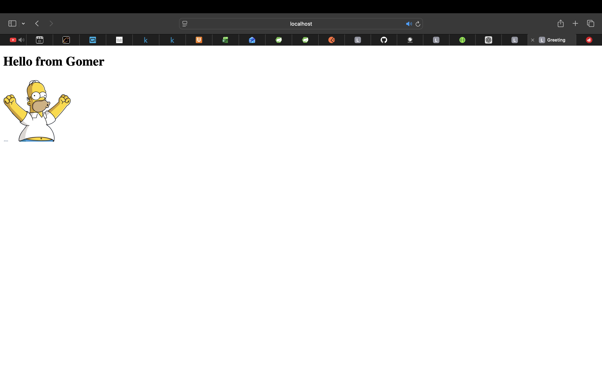

Task 1 – Spring Boot MVC Application

 Description
This project is a simple Spring Boot MVC application.
The goal of Task 1 is to demonstrate how Spring MVC works using a controller,
a Thymeleaf template and static resources

The application displays a greeting page rendered on the server side

 Technologies
- Java 17
- Spring Boot
- Spring Web (MVC)
- Thymeleaf
- Maven

 How to Run
1. Open the project in IntelliJ IDEA
2. Run the main application class
3. The application starts on port **8080**

 Use Case Description

Use Case 1: View Greeting Page

 
Description: 
The user opens the greeting page in a web browser.  
The application returns an HTML page rendered by Thymeleaf.

URL:
http://localhost:8080/greeting

- Greeting message is displayed
- Image gomer.png is shown (loaded from static resources)

Screenshot

Static Resources
The image used in the application is stored in

src/main/resources/static/gomer.png

Spring Boot serves static files automatically
